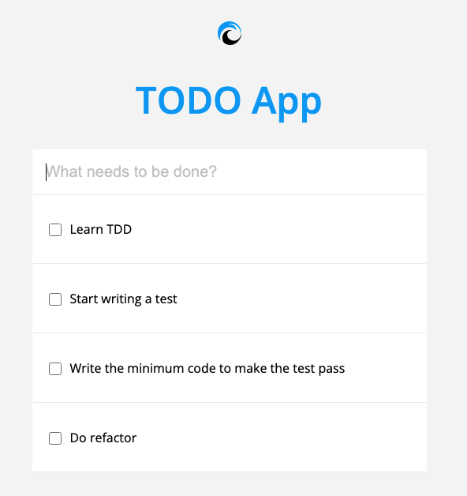
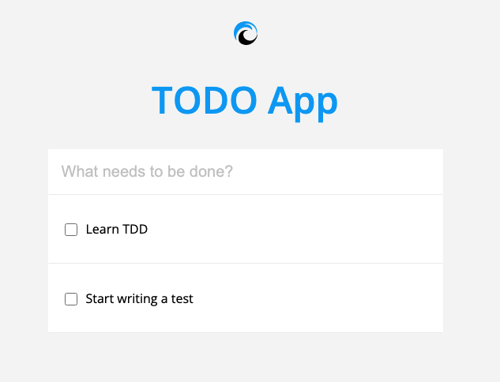

# TODO App kata
## Goal
The objective of this kata is to practice TDD in the front-end creating a React TODO application.

To develop the App we will use the Double loop technique:
- First write an E2E test with Cypress.
- Then do TDD in the inner parts of the React app using react-testing library.

To simplify the exercise, Cypress tests are provided.

## Initial setup
    npm install
    npm start  (or yarn start)

## To execute Cypress E2E tests
    npm run cypress:open

Click on todo.spec.js file. This will open a browser and execute the tests.

## To execute React Unit tests
Execute them inside your IDE or running:

    npm test

## Iteration 1: Display TODO list with some default items
For this first iteration we will execute the Cypress tests.
The execution will fail because the App is empty. We need to create the app applying TDD.

For this exercise let's image the default TODO App looks like this:

As you can see we should display: a title, an input and two TODO items inside a list.

At the end of this iteration, the first Cypress tests should pass.

## Iteration 2: Create a new TODO item
Now you need to implement the logic to create a new TODO item and add it to the list. 
The expected behaviour is as defined in the E2E test: "can add new todo items". 
We will apply again the Double-loop technique: first execute the second E2E Cypress test. Check that it fails. Now do TDD until the E2E test is green.
When the user types something in the input and presses "Enter" key then the new TODO item is added to the list. 
Once the element has been added to the list, input text should be empty.

## Iteration 3: Can check and uncheck a TODO item
We repeat the process of the previous iterations again: execute all Cypress tests.
You should implement now the behaviour: when click on a checkbox a css style is added the item (and removed if clicked again).
